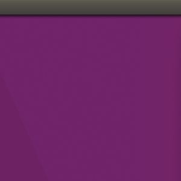

## NeoVim .vimrc - Full Featured Setup for Ubuntu 16.04

Standard NeoVim install on Ubuntu 16.04, via this ppa:
https://launchpad.net/~neovim-ppa

Location for files is `~/.config/nvim/` , with `~/.config/nvim/init.vim`
replacing the conventional `~/.vimrc`

Also included are resources to make a desktop launcher, complete with
a scaled version of the icon. Move the `.desktop` files to: 

``` 
$ ~/.local/share/applications/
```

...and move the `.png` icon to:

```
$ ~/.local/share/icons/ 
```

... then set your preferences for opening files accordingly, search for
NeoVim and add the program to the launcher.



The `init.vim` setup includes the following packages:
- ag.vim
- deoplete-go
- deoplete-jedi
- deoplete-ternjs
- deoplete.nvim
- goyo.vim
- hexmode
- matchem
- neomake
- nerdtree
- supertab
- vim-airline
- vim-easy-align
- vim-indent-guides
- vim-lexical
- vim-litecorrect
- vim-pencil 
- vim-pug
- vim-qml
- vim-surround

### Setup

Getting most of the plugins working requires only running `:PlugInstall`
when using `nvim` for the first time. However, on Ubuntu 16.04 a few other
steps need to be taken.

**Deoplete:** Getting IDE-like functionality with autocomplete and suggetions
with deoplete is quite easy. At the command line install `pip3` and the
`neovim` python3 package:

```
$ sudo apt install python3-pip
$ sudo pip3 install neovim
```

Once in `nvim`, run `:UpdateRemotePlugins`, restart, and deoplete will be working.

**vim-go:** This is a package that provides a crazy level of functionality for 
go-lang development. First, make sure your $GOPATH is set; this is requisite for a
working go-lang setup, so at some point it needs to be done. Usually, it's `/home/$USER/.go/`.
Once in `nvim`, run `:GoInstallBinaries`, done.

**Cut & Paste:** NeoVim requires the installation of `xsel` to
provide clipboard functionality: 

```
$ sudo apt install xsel 
```

which provides copy with `"+y`, and paste with the mouse or `Ctrl+v`, to
move content between programs like any gui app.

**JavaScript/ES5+:** Install NodeJS (with a tool like
[nvm](https://github.com/creationix/nvm)) and use `npm` to install
`ternjs` and `eslint` globally.
